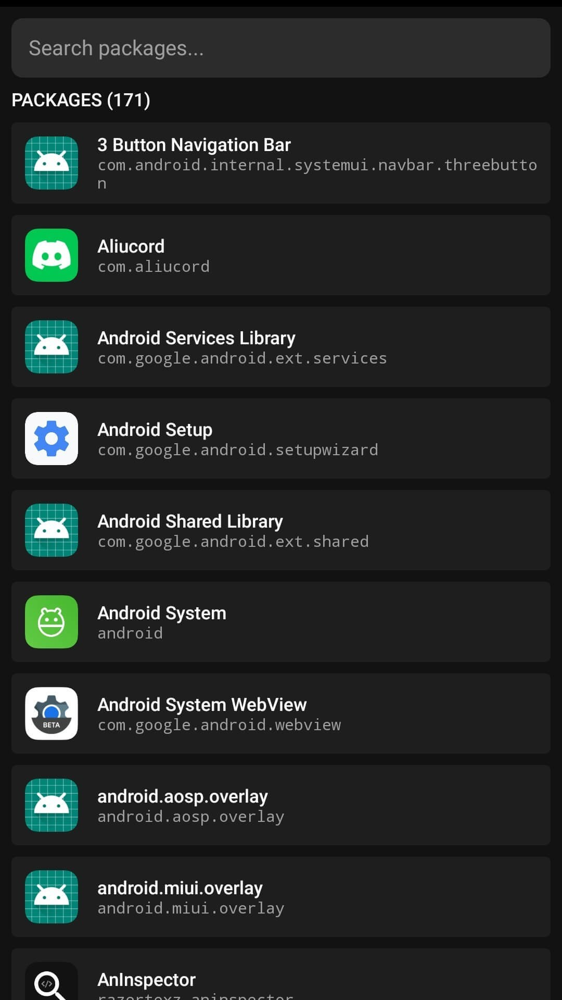
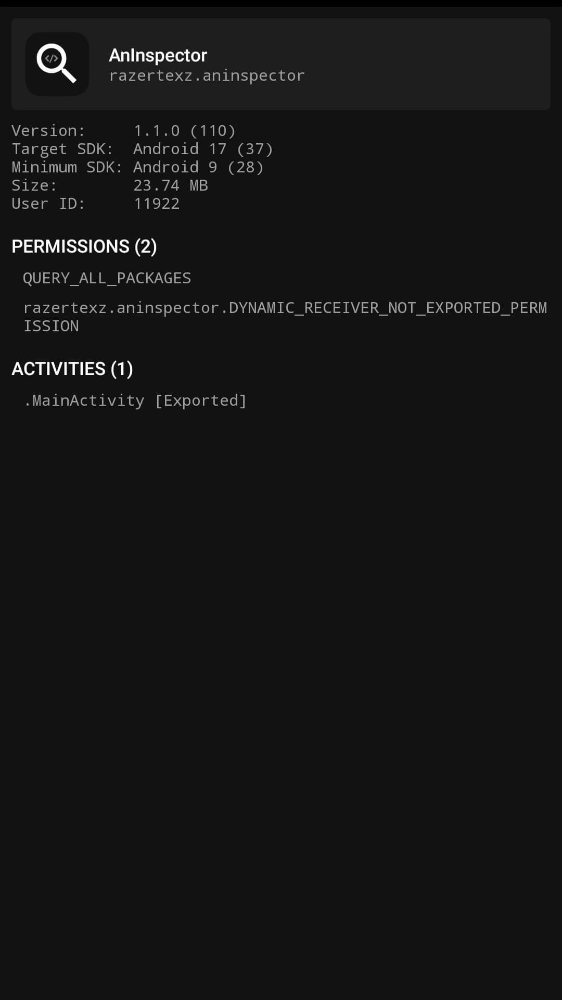

# AnInspector
A minimalist Android package inspector built with Kotlin and Jetpack Compose.

**View installed package details:**

- Target and minimum SDK
- Version name and code
- Size and user ID
- Permissions and activities

<table align="center">
    <tr>
        <td></td>
        <td></td>
    </tr>
</table>

## Building
Requires JDK 21.

### Windows
```cmd
.\gradlew assembleDebug & rem Output: app/build/outputs/apk/debug/app-debug.apk
```

### Linux / macOS
```bash
./gradlew assembleDebug # Output: app/build/outputs/apk/debug/app-debug.apk
```