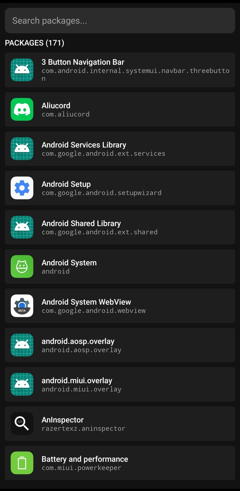
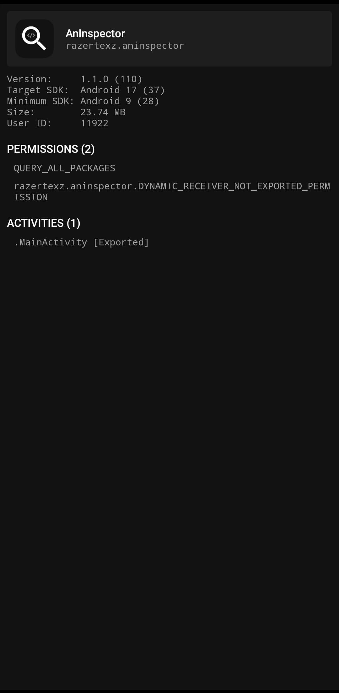

# AnInspector
A minimalist Android package inspector built with Kotlin and Jetpack Compose.

<table align="center">
    <tr>
        <td></td>
        <td></td>
    </tr>
</table>

## Building
### Windows
```cmd
.\gradlew assembleDebug & rem Output: app/build/outputs/apk/debug/app-debug.apk
```

### Linux / macOS
```bash
./gradlew assembleDebug # Output: app/build/outputs/apk/debug/app-debug.apk
```